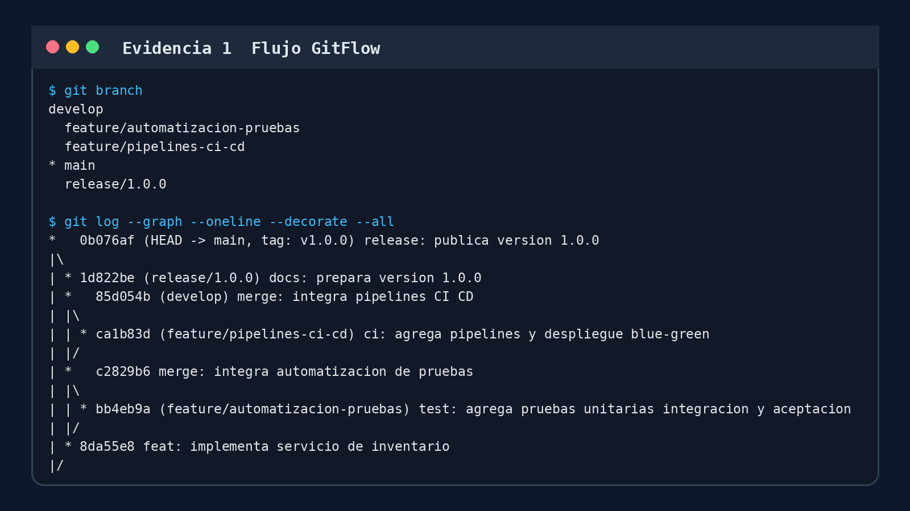
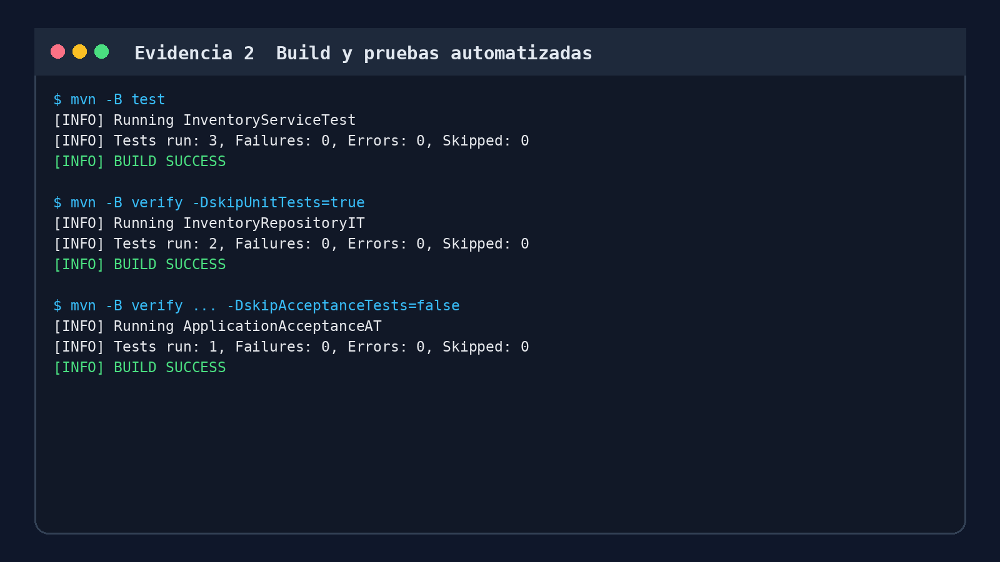
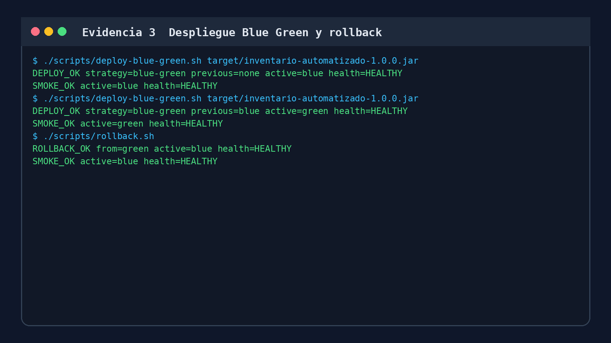

# Inventario Automatizado

Proyecto desarrollado para demostrar un proceso completo de automatización de pruebas, integración continua y despliegue continuo. La aplicación administra un inventario básico: registra productos, descuenta existencias al vender y repone stock.

## Estrategia de versionado

Se utiliza **GitFlow** porque permite separar el trabajo estable del desarrollo:

- `main`: versiones listas y etiquetadas.
- `develop`: integración del trabajo terminado.
- `feature/*`: cambios aislados antes de integrarlos.
- `release/*`: preparación y validación de una entrega.

Los cambios se integran mediante merge y la versión entregable se identifica con el tag `v1.0.0`.

## Pruebas implementadas

| Tipo | Archivo | Qué comprueba |
|---|---|---|
| Unitaria | `InventoryServiceTest` | Reglas de venta, stock insuficiente y SKU duplicado. |
| Integración | `InventoryRepositoryIT` | Funcionamiento conjunto del servicio y el repositorio. |
| Aceptación | `ApplicationAcceptanceAT` | Ejecución del JAR y resultado visible del flujo registro-venta. |

## Requisitos

- Java 17
- Maven 3.9 o superior
- Git
- Bash para ejecutar los scripts de despliegue

## Ejecución local

```bash
# Build
mvn -B clean package -DskipUnitTests=true -DskipIntegrationTests=true -DskipAcceptanceTests=true

# Pruebas unitarias
mvn -B test

# Pruebas de integración
mvn -B verify -DskipUnitTests=true

# Pruebas de aceptación
mvn -B verify -DskipUnitTests=true -DskipIntegrationTests=true -DskipAcceptanceTests=false
```

## Integración continua

El archivo `.github/workflows/ci.yml` ejecuta los stages de build, pruebas unitarias y pruebas de integración en cada push o pull request. Los reportes Surefire y Failsafe se guardan como artefactos, incluso cuando una prueba falla.

También se incluye un `Jenkinsfile` equivalente para demostrar que la solución no depende de una única plataforma.

Evidencia remota verificada: [GitHub Actions, ejecución N.° 6 completada correctamente](https://github.com/Br4doXOficial/proyecto-pruebas/actions/runs/35283980657).

## Deployment pipeline

El workflow `.github/workflows/deployment.yml` realiza build, acceptance tests, despliegue Blue-Green y smoke test. El script `deploy-blue-green.sh` instala el JAR en el slot inactivo y solo cambia el enlace `deploy/current` después de obtener la respuesta `HEALTHY`.

```bash
./scripts/deploy-blue-green.sh target/inventario-automatizado-1.0.0.jar
./scripts/smoke-test.sh
```

## Rollback

Si el despliegue falla, el pipeline intenta ejecutar automáticamente `rollback.sh`. También puede iniciarse de forma manual desde el workflow de despliegue seleccionando la operación `rollback`.

```bash
./scripts/rollback.sh
./scripts/smoke-test.sh
```

El cambio de versión se hace mediante un enlace simbólico, por lo que no es necesario reconstruir el artefacto anterior y el retorno es inmediato.

### Ejecución equivalente en Windows

Desde PowerShell, la evidencia completa de build, despliegue Blue-Green, smoke test y rollback se obtiene con:

```powershell
powershell -ExecutionPolicy Bypass -File .\scripts\evidencia-windows.ps1
```

El script utiliza los slots `deploy-windows\blue` y `deploy-windows\green`, comprueba la respuesta `HEALTHY` antes de activar cada versión y conserva el slot anterior para ejecutar el rollback.

## Evidencias

La carpeta `evidencias` contiene capturas obtenidas desde ejecuciones reales del repositorio local:

1. Historial y ramas GitFlow.
2. Build y pruebas Maven exitosas.
3. Despliegues Blue-Green, smoke test y rollback exitoso.

### Flujo GitFlow



### Build y pruebas



### Despliegue y rollback



## Archivos principales

- `pom.xml`: dependencias y configuración de Maven.
- `.github/workflows/ci.yml`: pipeline de integración continua.
- `.github/workflows/deployment.yml`: pipeline de aceptación y despliegue.
- `Jenkinsfile`: alternativa declarativa de CI/CD.
- `scripts/`: despliegue, smoke test y rollback.
- `src/main`: código de la aplicación.
- `src/test`: pruebas unitarias, de integración y aceptación.
